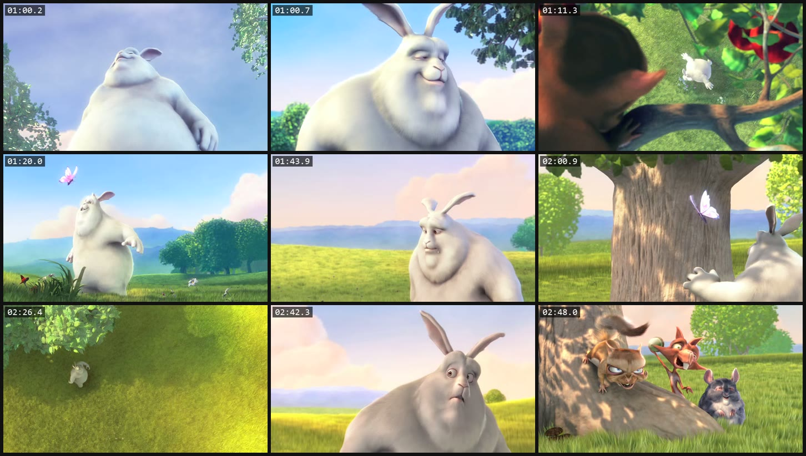

# video-watch

A Claude Code plugin that lets Claude actually watch a video.

A model cannot open an `.mp4`. This extracts frames with ffmpeg and hands them
back as images it can read, so "look at this screen recording and tell me what
went wrong" becomes a thing you can ask.

```
/plugin marketplace add ridelink0/video-watch
/plugin install video-watch@video-watch
```

Then:

```
/watch-video path/to/recording.mkv
```



<sub>Real output of `node scripts/watch.mjs BigBuckBunny_640x360.m4v --mode scene --from 60 --to 180 --n 9 --sheet 3x3 --label`: 8 scene cuts and one fill frame, about 1,560 visual tokens for the sheet. Big Buck Bunny (c) 2008 Blender Foundation, [CC BY 3.0](https://creativecommons.org/licenses/by/3.0/), [peach.blender.org](https://peach.blender.org).</sub>

Or drive it directly:

```
node scripts/watch.mjs recording.mkv --n 12 --sheet 3x3
node scripts/watch.mjs demo.mp4 --mode scene --from 30 --to 90 --label
```

## What it does

- **Evenly spaced frames** by default, or `--mode scene` to cut where the
  picture actually changes, which is usually where the interesting thing
  happened. If it finds no cuts it says so and falls back to a grid rather than
  reporting a scene pass it did not do.
- **Contact sheets** (`--sheet 3x3`) so a long recording can be scanned in a
  few images instead of forty.
- **Timestamps burned into the corner** with `--label`, so a frame can be
  pointed at by time.
- **A range** with `--from` and `--to`, in seconds.
- **A JSON manifest** with `--json`: every frame, its timestamp, and what the
  run actually did.

## Requirements

ffmpeg and ffprobe on `PATH`. Nothing else - no dependencies, no API calls,
nothing leaves the machine.

## Install

```
/plugin marketplace add ridelink0/video-watch
/plugin install video-watch@video-watch
```

## Notes

`--out` refuses to write into a directory that already has files in it unless
you pass `--force`. An earlier version wiped whatever was there, which is a
thing you only need to have happen once.

Frames go to a temporary directory by default, named after the video.

MIT.
